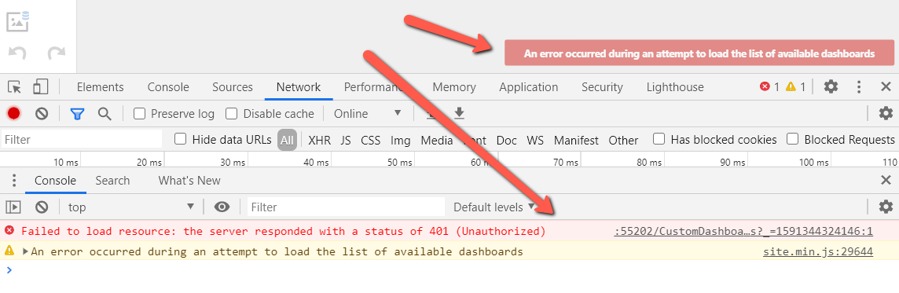

<!-- default badges list -->

[](https://supportcenter.devexpress.com/ticket/details/T896804)
[](https://docs.devexpress.com/GeneralInformation/403183)
[](#does-this-example-address-your-development-requirementsobjectives)
<!-- default badges end -->
# Dashboard for ASP.NET Core - How to implement authentication

This example demonstrates how to implement authentication based on [JWT](https://developer.okta.com/blog/2018/03/23/token-authentication-aspnetcore-complete-guide).

## Files to Review

* [Startup.cs](./CS/Startup.cs)
* [Dashboard.cshtml](./CS/Views/Home/Dashboard.cshtml)
* [Login.cshtml](./CS/Views/Home/Login.cshtml)
* [AccountController.cs](./CS/Controllers/AccountController.cs)

## Example Structure

An [AccountController](CS/Controllers/AccountController.cs) generates JWT tokens for the predefined set of users. Once the token is generated, the app saves it to [sessionStorage](https://www.w3schools.com/jsref/prop_win_sessionstorage.asp) in the [Login](CS/Views/Home/Login.cshtml) view.

The [Dashboard](CS/Views/Home/Dashboard.cshtml) view passes this token to the [CustomDashboardController](CS/Controllers/CustomDashboardController.cs) (it is marked with the [AuthorizeAttribute](https://docs.microsoft.com/en-us/dotnet/api/microsoft.aspnetcore.authorization.authorizeattribute?view=aspnetcore-3.1)) by using the [AjaxRemoteService.headers](https://docs.devexpress.com/Dashboard/js-DevExpress.Dashboard.AjaxRemoteService#js_devexpress_dashboard_ajaxremoteservice_headers) dictionary:

```js
const tokenKey = "accessToken";
function onBeforeRender(sender) {
    var dashboardControl = sender;
    const token = sessionStorage.getItem(tokenKey);
    dashboardControl.remoteService.headers = { "Authorization": "Bearer " + token };
}
```

Main JWT and Dashboard configurations are defined in the [Startup.cs](CS/Startup.cs) file. We use the [IHttpContextAccessor](https://docs.microsoft.com/en-us/aspnet/core/fundamentals/http-context?view=aspnetcore-3.0) with dependency injection to access the current user name (`HttpContext.User.Identity.Name`) in code. Note that you can access it in [DashboardConfigurator](https://docs.devexpress.com/Dashboard/DevExpress.DashboardWeb.DashboardConfigurator?p=netframework) events and Dashboard storages. Here are corresponding code parts:

```cs
// Startup.cs:
var contextAccessor = serviceProvider.GetService<IHttpContextAccessor>();
configurator.CustomParameters += (s, e) => {
    e.Parameters.Add(new DashboardParameter("LoggedUser", typeof(string), contextAccessor.HttpContext.User.Identity.Name));
};
...
// CustomDashboardStorage.cs:
protected override XDocument LoadDashboard(string dashboardID) {
    Debug.WriteLine(сontextAccessor.HttpContext.User.Identity.Name);
    return base.LoadDashboard(dashboardID);
}
```

If you open the [Dashboard](CS/Views/Home/Dashboard.cshtml) view without logging in, you see the following error:



## Documentation

- [Manage Multi-Tenancy](https://docs.devexpress.com/Dashboard/402924/web-dashboard/dashboard-backend/manage-multi-tenancy)

## More Examples

- [ASP.NET Core Dashboard - How to implement multi-tenant Dashboard architecture](https://github.com/DevExpress-Examples/DashboardUserBasedAspNetCore)
- [ASP.NET Core Dashboard - How to load different data based on the current user](https://github.com/DevExpress-Examples/DashboardDifferentUserDataAspNetCore)
- [ASP.NET Core Dashboard - How to implement authentication](https://github.com/DevExpress-Examples/ASPNET-Core-Dashboard-Authentication)
<!-- feedback -->
## Does this example address your development requirements/objectives?

[](https://www.devexpress.com/support/examples/survey.xml?utm_source=github&utm_campaign=aspnet-core-dashboard-jwt-authentication&~~~was_helpful=yes) [](https://www.devexpress.com/support/examples/survey.xml?utm_source=github&utm_campaign=aspnet-core-dashboard-jwt-authentication&~~~was_helpful=no)

(you will be redirected to DevExpress.com to submit your response)
<!-- feedback end -->
